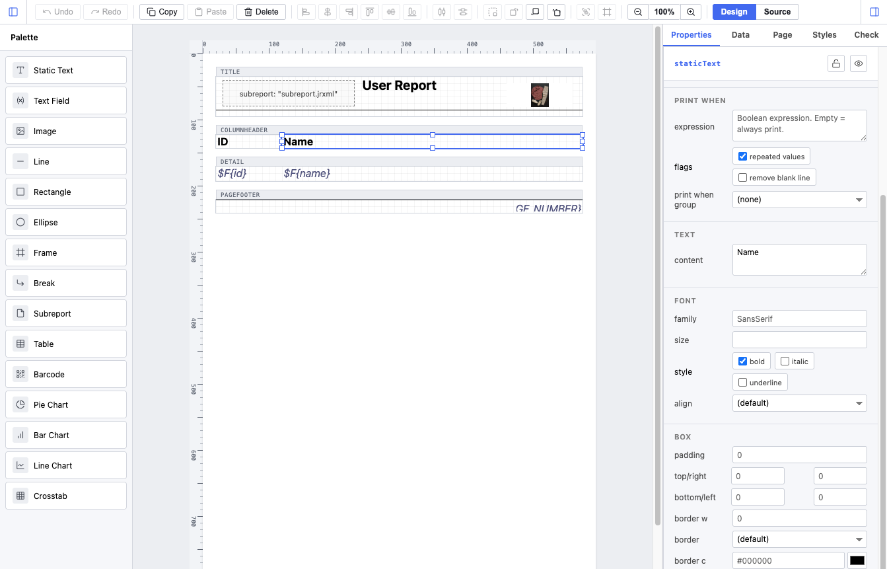

# ngx-jrxml-editor

A web-based JRXML template editor for **JasperReports 7+**, packaged as an Angular 19+ library.

Build PDF report templates visually in the browser, save them as `.jrxml`, and feed them to your existing JasperReports server / engine for rendering.



## Status

**v0.1 — usable for authoring most JR templates.** See [CHANGELOG.md](./CHANGELOG.md) for shipped features and the [library README](./projects/ngx-jrxml-editor/README.md) for the public API.

## Quick start (consumer)

```bash
npm install @florianrauscha/ngx-jrxml-editor
```

```ts
import { Component, signal } from '@angular/core';
import { JasperEditorComponent } from '@florianrauscha/ngx-jrxml-editor';

@Component({
  standalone: true,
  imports: [JasperEditorComponent],
  template: `
    <lib-jasper-editor
      [jrxml]="xml()"
      (jrxmlChange)="xml.set($event)" />
  `,
  styles: ['lib-jasper-editor { display: block; height: 100vh; }'],
})
export class AppComponent {
  xml = signal<string>('<?xml version="1.0"?>...');
}
```

See the [library README](./projects/ngx-jrxml-editor/README.md) for full API documentation.

## Repository layout

```
ngx-jrxml-editor/
├── projects/
│   ├── ngx-jrxml-editor/   # the publishable Angular library (npm: ngx-jrxml-editor)
│   └── demo/               # local Angular 19 host app for manual testing
├── test/                   # Vitest round-trip tests for the JRXML codec
├── README.md
├── CHANGELOG.md
└── LICENSE
```

The library is **framework-agnostic at the codec layer** (`projects/ngx-jrxml-editor/src/lib/model` and `.../jrxml` are pure TypeScript, no Angular imports), so the parser/serializer can be reused outside Angular if you ever need to.

## Development

Requirements: **Node 20+**, **Angular CLI 19+**.

```bash
# Install workspace deps
npm install

# Build the library
ng build ngx-jrxml-editor

# Run the demo app (with the library hot-reloading)
ng serve demo

# Run the JRXML round-trip tests
npx vitest run
```

The demo app at `http://localhost:4200` (or `4321` if specified) loads two sample reports — a basic report and a table-component report — for manual testing.

## What's in scope

| Area | Status |
|------|--------|
| JRXML parse / serialize (round-trip) | ✅ |
| Bands: title / pageHeader / columnHeader / detail (multi) / pageFooter / summary / lastPageFooter / noData / background | ✅ |
| **Group bands** (`<group>` with multi-band groupHeader / groupFooter) — full UI: add / remove groups, edit expression, manage header/footer band counts | ✅ |
| Elements: staticText, textField, image, line, rectangle, ellipse, frame, break, subreport | ✅ |
| Tables (`jr:table` component): columns, header / footer / detail cells, sub-datasets | ✅ |
| Barcodes (`jr:barcode4j`): all 14 1D + 2D types incl. QR / DataMatrix / PDF417 | ✅ |
| **Charts**: pie / pie3D / bar / bar3D / stackedBar / line / area / stackedArea, with pie & category datasets, series CRUD, axis labels, legend toggle | ✅ |
| **Crosstabs** (`<crosstab>`): row groups, column groups, measures, sub-dataset binding, total positions | ✅ |
| Selection (single + multi), marquee, drag-to-move, 8-handle resize (incl. **frame children**), **alignment guides while dragging**, copy / cut / paste, delete, undo / redo | ✅ |
| **Element grouping**: wrap / unwrap selected siblings into `<elementGroup>` from toolbar or `⌘G` / `⇧⌘G` | ✅ |
| Alignment + distribution toolbar (L · H-center · R · T · V-center · B · distribute H/V) | ✅ |
| **Z-order**: bring to front / forward, send backward / to back (toolbar + `⌘]` `⇧⌘]` `⌘[` `⇧⌘[`) | ✅ |
| **Keyboard nudge** (arrows = 1px, Shift+arrows = 10px) — collapsed into single undo entries while held | ✅ |
| **Lock / hide-in-editor** per-element toggles (round-trip via JR `<property>` so other tools see them) | ✅ |
| Inspector: position, colors, font / box / paragraph, kind-specific editors, **printWhenExpression**, **isPrintRepeatedValues**, **printWhenGroupChanges**, **hyperlink** (textField + image), **subreport parameter mapping** | ✅ |
| **Expression picker** — autocomplete dropdown for `$F{}` / `$P{}` / `$V{}` / `$R{}` references in every expression input | ✅ |
| **Conditional styles UI** — add / edit `<conditionalStyle>` overrides per style (condition expression + colors / font / border) | ✅ |
| Datasource panel: fields, parameters, variables — **drag a row onto the canvas** to create a bound `$F{}` / `$P{}` / `$V{}` textField | ✅ |
| Page tab: paper presets, orientation, margins, columns, bands, **groups** | ✅ |
| Source view: live two-way XML edit with syntax highlighting, **`⌘F` find / replace**, parse-error gutter | ✅ |
| **Validation panel**: live errors + warnings (unknown `$F{}` / `$P{}` / `$V{}` references, empty required expressions, duplicate names, incomplete crosstabs/charts) — click an issue to jump to its element | ✅ |
| Live PDF preview | ❌ out of scope (rendering is the host engine's job) |
| Cell-child resize handles inside table cells | ❌ deferred (use the inspector) |

See [CHANGELOG.md](./CHANGELOG.md) for what shipped in each release.

## License

[MIT](./LICENSE)
